Azure AI Search provides powerful built-in cognitive skills for common AI tasks like sentiment analysis, key phrase extraction, and entity recognition. However, real-world business scenarios often require specialized processing that goes beyond these standard capabilities. This is where Custom Skills become essential.Custom Skills are user-defined capabilities that extend Azure AI Search's AI enrichment pipeline by integrating your own business logic, specialized algorithms, or external APIs. They enable you to:

* Apply domain-specific knowledge that built-in skills don't understand
* Integrate with existing business systems and APIs
* Implement proprietary algorithms for competitive advantage
* Handle unique data formats or processing requirements
* Combine multiple AI services in sophisticated ways

In this lab, you'll build a Custom Sentiment Analysis Skill that enhances Azure AI Search's built-in capabilities with hotel industry-specific intelligence.Standard sentiment analysis doesn't understand hotel industry nuances. A review saying "small room" might be neutral for apartments but negative for hotels. "Close to airport" might be positive for business travelers but negative for leisure guests.

## Instructions

This foundational stage establishes the complete Azure infrastructure required for custom skills development. You'll create the essential Azure services that form the backbone of an AI-powered search solution: Azure AI Search for the search engine, Storage Account for data hosting, and Function App for custom skill hosting.

Custom skills require a coordinated set of Azure services to work together seamlessly. The search service orchestrates the AI pipeline, storage provides scalable data access, and the function app enables serverless custom logic execution. Proper resource configuration in this stage ensures smooth integration in later stages and establishes the foundation for production-ready custom skills architecture.

1. Download Azure Sample Datasets:
   Navigate to Azure sample data sources:
   - Hotels data: [Azure Search Sample Data](https://github.com/Azure-Samples/azure-search-sample-data/tree/main/hotelreviews)
       
      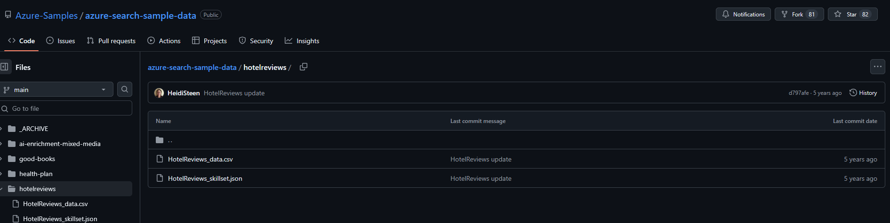
   
   
2. To Create Azure AI Search Resource access Azure Portal:
   - Navigate to [Azure Portal](https://portal.azure.com)
   - Sign in with your Azure subscription credentials

3. Search `AI Search ` service in the Azure Portal search bar:
   
      
   
4. Click `+ Create` to create a new AI search Service:
   
      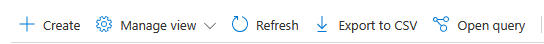

5. Configure with the following settings:
     ```
     Subscription: [Your Azure Subscription]
     Resource Group: [Create new] omnicorp-custskillset-rg
     Service Name: omnicorp-custskillset-[yourname][random]
     Location: East US (or available region)
     Pricing Tier: Basic (required for multiple data sources)
     ```
     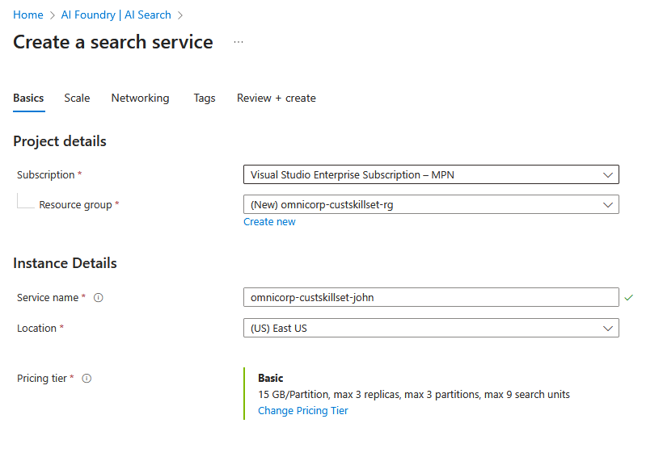

6. Click `Review + create`:
   
     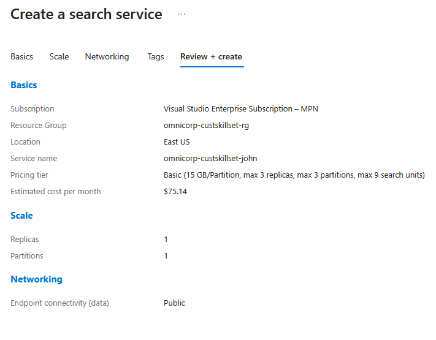

7. Then `Create` to create the service:
   
     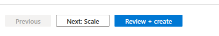


### Create Storage Account 

8. To Create Azure Storage Account, go to Azure Portal and in the Search bar search for `Storage accounts`:
     

         *Do not select Storage account (Classic)*
9.  Click `+ Create` to create a storage account:
    
      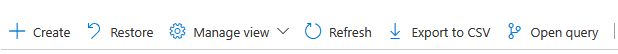

10. Configure it with following settings:
   
   
     ```
     Subscription: [Your Azure Subscription]
     Resource Group: omnicorp-custskillset-rg
     Storage Account Name: omnicorpstorage[yourname][random]
     Primary service: Azure Blob Storage or Azure Data Lake Storage Gen 2
     Region: East US
     Performance: Standard
     Redundency: Locally-redundant storage (LRS)
     ```
     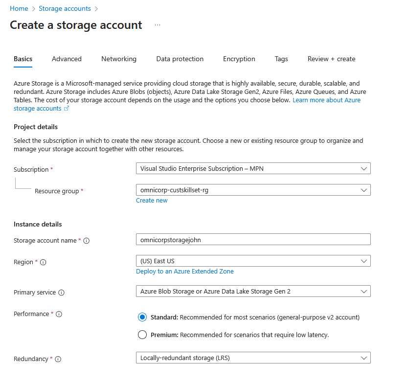

   - On the **Advanced** tab, check **"Allow enabling anonymous access on individual containers"**
      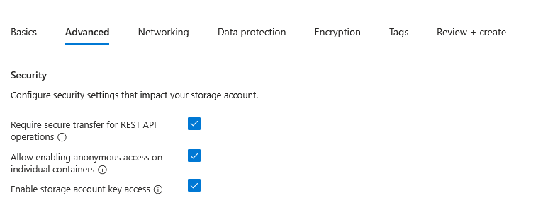

11.  Click `Review + create`:
   
     

12. Then `Create` to create the service:
   
     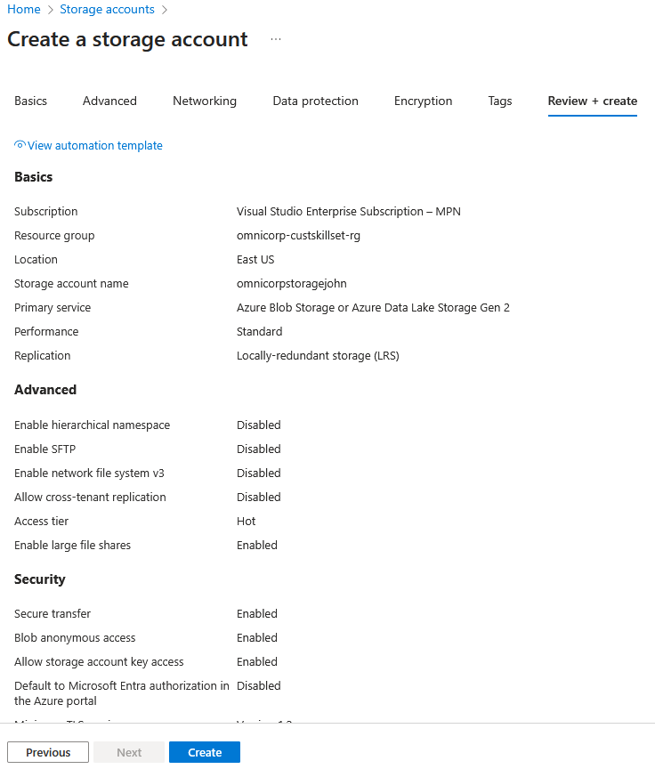

13. Let's create Containers to hold Hotel reviews and book data for the search: Search for the Storage accounts in azure portal and go to newly created Storage account:

    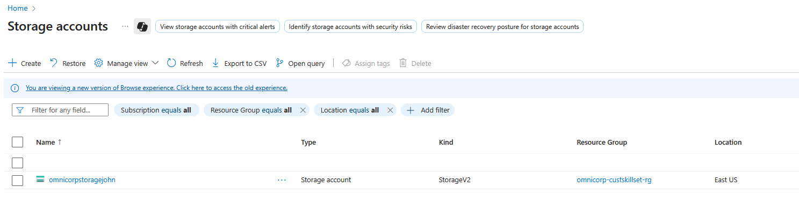

14.  In the leftside menu under `Data storage` select `Containers`:
   
     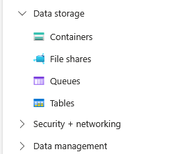

15.  Click `+ Add container` to create the Hotels Container with following data:
   - Name:  `hotels-data`.
   - Set access level to `Container`.
  
     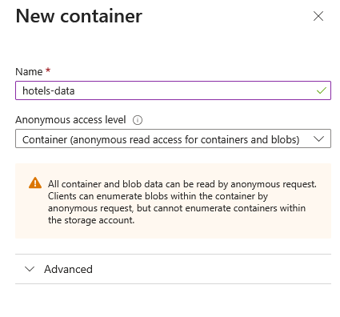
16.  Upload the Downloaded  `hotels.csv` file from the Azure sample data repository. Click `Upload` :
    
     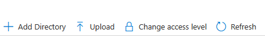

17. Browse for the downloaded file or drag and drop the file to upload:
   
     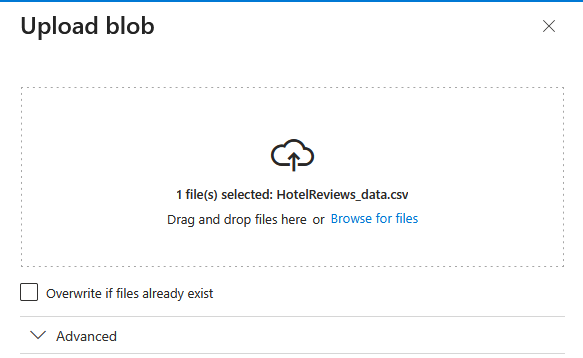

18. Click `Upload`:
    
     