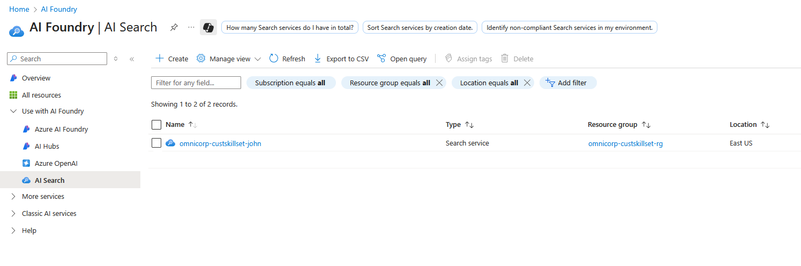
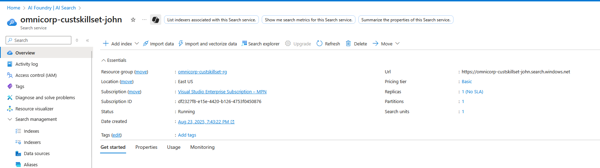
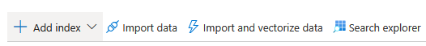
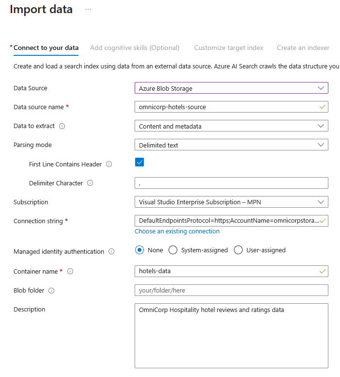
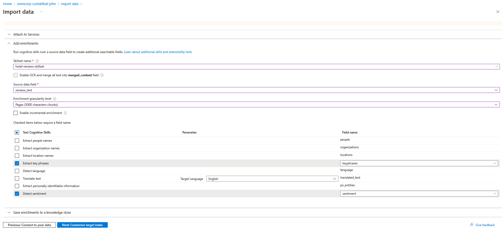
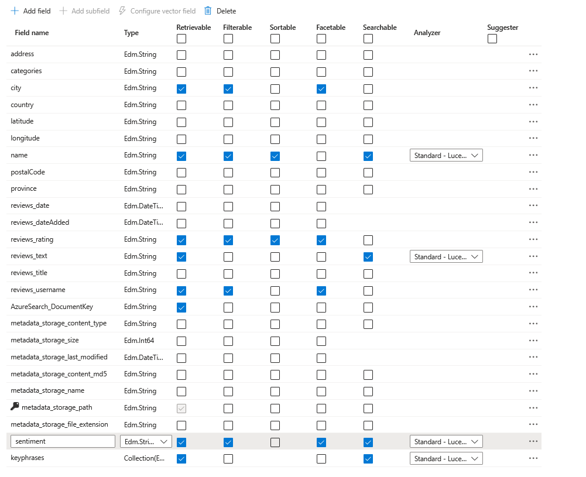
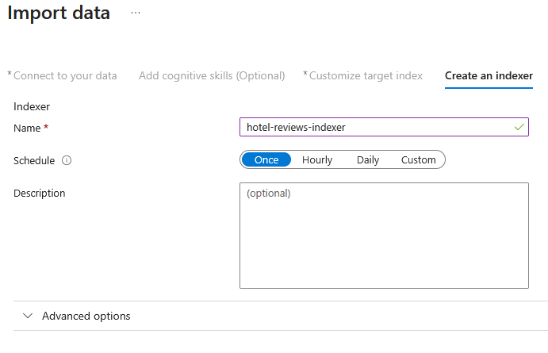

This exercise focuses on establishing the AI enrichment pipeline using Azure AI Search's built-in cognitive skills. You'll configure the data source to parse CSV hotel reviews, create a skillset with sentiment analysis and key phrase extraction, design the search index schema, and run the indexer to process reviews. This creates the foundation pipeline that you'll enhance with custom skills in later exercises

## Instructions.
Create Hotels Data Source and Index

1. Navigate to your Azure AI Search resource. Search AI Search in Azure portal:
   
   

2. Select the `omnicorp-search-3456` Ai Search:
   
   

3. Click `Import data` on the Overview page:
   
   

4. Configure Hotel Reviews Data Source:
   
   - Data Source: **Azure Blob Storage**
   - Complete the configuration:
    
     - Data source name: omnicorp-hotels-source
     - Connection string: [Select your storage account → hotels-data container]
     - Parsing mode: Delimited text
     - First line contains headers: Yes
     - Delimiter character: Comma
     - Description: OmniCorp Hospitality hotel reviews and ratings data
     
    
  

5. Add Cognitive Skills (Using Built-in Skills for Now)
   - **Attach AI Services**: Skip for now (click **Skip**)
   - Expand **Add enrichments**:
   - Skillset name: `hotel-reviews-skillset`
   - **Source data field**: Select `reviews_text` 
   - Do not select `Enable OCR and merge all text into merged_content field`
   - for `Source data field` select `reviews_text`
   - Enrichment granularity: `Pages`
   - Select Following `Text Cognitive Skills` for enrichments:
     - ✅ Extract key phrases
     - ✅ Detect sentiment
   - **Save enrichments to a knowledge store**: Skip (leave unchecked)
  
   

6. Click **Next: Customize target index**
   
   

**Note**: We're using built-in skills on the `reviews_text` field first. Later we'll add our custom Azure Function skill.

7. Customize Target Index
   - **Index name**: `hotel-reviews-index`
   - **Key**: Choose `AzureSearch_DocumentKey` (this will be auto-generated)
   - **Configure the fields** - Make sure these CSV fields are set correctly:
      - `name`: Searchable ✅, Filterable ✅, Retrievable ✅, Sortable ✅
      - `reviews_text`: Searchable ✅, Retrievable ✅
      - `reviews_rating`: Filterable ✅, Retrievable ✅, Sortable ✅, Facetable ✅
      - `reviews_title`: Searchable ✅, Retrievable ✅
      - `reviews_username`: Filterable ✅, Retrievable ✅, Facetable ✅
      - `address`: Searchable ✅, Filterable ✅, Retrievable ✅
      - `city`: Filterable ✅, Retrievable ✅, Facetable ✅
      - `keyphrases`: Searchable ✅, Retrievable ✅
      - `sentiment`: **Searchable ✅, Filterable ✅, Facetable ✅, Retrievable ✅**
  
   

**Important**: Make sure `sentiment` has **Filterable** and **Facetable** checked, or you'll get filter errors later!

1. Click `Next: Create an indexer`:
   
   

9.  Configure the Indexer as follow:
     **Indexer name**: `hotel-reviews-indexer`
     **Schedule**: Once
     **Advanced options**:
      - Parsing mode: **Delimited text**
      - First line contains headers: ✅ Yes
  
  

10.  Click `Submit`:

