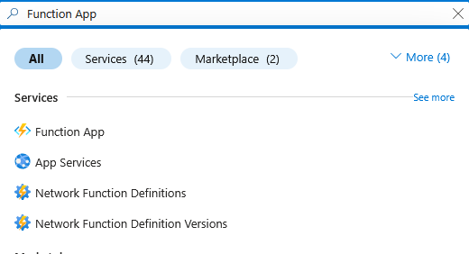
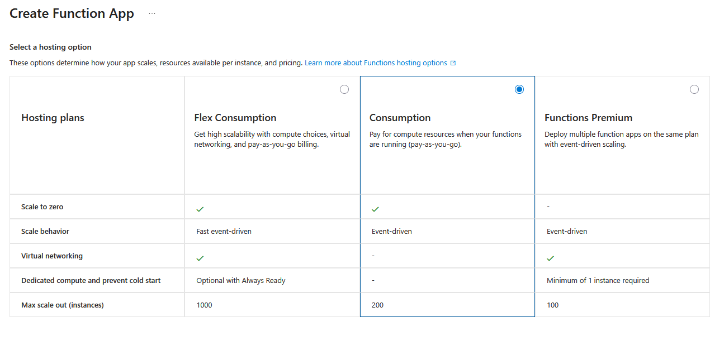
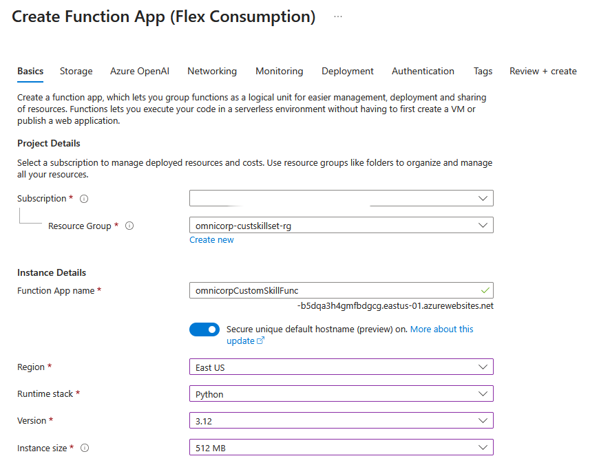
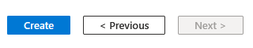
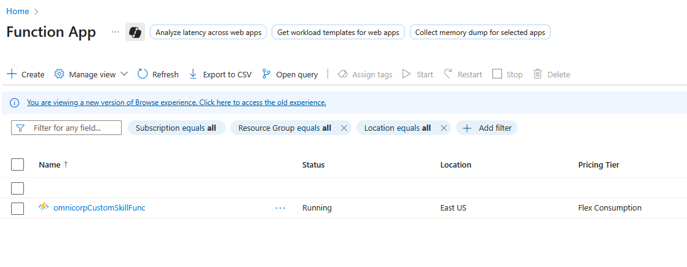
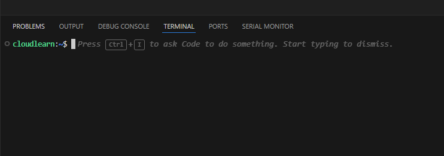
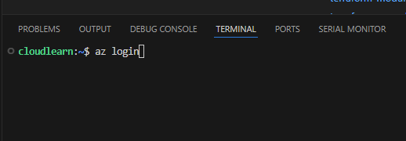
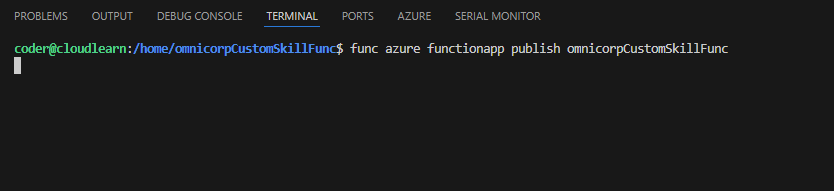
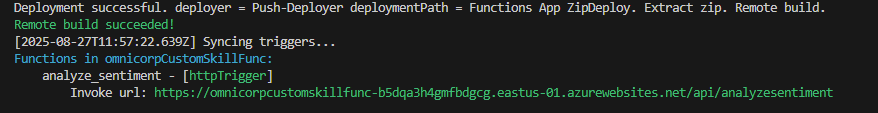
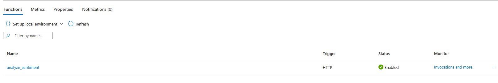

Here you'll develop the core custom skill using Azure Functions and VS Code. You'll implement hotel-specific sentiment analysis logic that goes beyond built-in capabilities, incorporating business rules for the hospitality industry. The function will analyze review text combined with ratings to provide enhanced sentiment scoring, topic extraction, and confidence levels that standard cognitive skills cannot deliver.

## Instructions.
Create Azure Function App 

1. In the Azure portal, search for `Function App`:
   
   

2. Select `Consumption` as the SKU for this lab then click `Select`:

   

3. Configure Basics:

      * Subscription: Select your subscription.
      * Resource Group: Select `omnicorp-custskillset-rg`.
      * Function App name: Provide a globally unique name (e.g., omnicorpCustomSkillFunc).
      * Runtime stack: Select `Python`.
      * Version: Choose  `3.12`.
      * Region: Select the same region as your VNet.
      * Instance size: Select `512 MB`
  
    

    Keep all other configurations in each tab as it is.

4. Review and Create: Click `Review + create` then click `Create`:

      

5. In the Azure portal, search for `Function App`and select newly deployed Function app.
      


6. Let's create the Azure Function project directory and all code.
7. Open Visual Studio Code and Integrated Terminal. You can do this in a few ways:

    ```
    * Go to **Terminal > New Terminal** from the top menu.
    * Use the keyboard shortcut:
        * Windows/Linux: `Ctrl + `` (backtick)
        * macOS: `Cmd + `` (backtick)
    ```
    

    A terminal window will appear at the bottom of your VS Code interface.

8. create a Directory in VScode and name it as `omnicorpCustomSkillFunc`. You can use terminal to create this directory.
    ```bash
    mkdir omnicorpCustomSkillFunc
    ```
   

9.  Pull the code samples using following git command. 
    
    ```bash
    ##git pull command for azure function
    ```

10. Once pull the git code open the `function_app.py` file and go through it without making any changes.This Azure Function is an HTTP-triggered Python script designed to perform sentiment analysis on hotel reviews. It processes a batch of reviews sent in a JSON request, analyzes each one, and returns the sentiment, a confidence score, and key topics discussed.

    ```bash
    import azure.functions as func
    import json
    import logging

    app = func.FunctionApp()

    @app.route(route="AnalyzeSentiment", auth_level=func.AuthLevel.FUNCTION)
    def analyze_sentiment(req: func.HttpRequest) -> func.HttpResponse:
        logging.info('Hotel sentiment analysis function triggered')
        
        try:
            req_body = req.get_json()
            response = {"values": []}
            
            for record in req_body.get("values", []):
                record_id = record.get("recordId")
                data = record.get("data", {})
                
                # Get the review data from your CSV structure
                review_text = data.get("reviewText", "")
                rating = data.get("rating", 0)
                hotel_name = data.get("hotelName", "")
                
                # Analyze the review
                analysis = analyze_review_sentiment(review_text, rating, hotel_name)
                
                response["values"].append({
                    "recordId": record_id,
                    "data": analysis
                })
            
            return func.HttpResponse(
                json.dumps(response),
                mimetype="application/json"
            )
        
        except Exception as e:
            logging.error(f"Error: {str(e)}")
            return func.HttpResponse(f"Error: {str(e)}", status_code=500)

    def analyze_review_sentiment(review_text, rating, hotel_name):
        """Analyze sentiment of hotel review"""
        
        text = review_text.lower() if review_text else ""
        
        # Enhanced word lists for hotel reviews
        positive_words = [
            "excellent", "great", "wonderful", "amazing", "perfect", "outstanding",
            "clean", "comfortable", "beautiful", "friendly", "helpful", "fantastic",
            "lovely", "superb", "exceptional", "gorgeous", "spacious", "convenient",
            "delicious", "pleasant", "nice", "good", "satisfied", "recommend",
            "enjoyed", "relaxing", "quiet", "peaceful", "welcoming"
        ]
        
        negative_words = [
            "terrible", "awful", "dirty", "rude", "noisy", "uncomfortable", "bad",
            "poor", "disappointed", "horrible", "unacceptable", "disgusting", "worst",
            "broken", "cold", "hot", "expensive", "crowded", "small", "cramped",
            "unfriendly", "slow", "problem", "issues", "complain", "unsatisfied"
        ]
        
        # Count sentiment words
        pos_count = sum(1 for word in positive_words if word in text)
        neg_count = sum(1 for word in negative_words if word in text)
        
        # Use rating as additional sentiment indicator
        try:
            rating_num = float(rating) if rating else 0
            
            # Combine word count with rating
            if rating_num >= 4 and pos_count > neg_count:
                sentiment = "Positive"
                confidence = min(0.9, 0.6 + (pos_count * 0.05))
            elif rating_num <= 2 or neg_count > pos_count:
                sentiment = "Negative" 
                confidence = min(0.9, 0.6 + (neg_count * 0.05))
            elif rating_num == 3:
                sentiment = "Neutral"
                confidence = 0.5
            else:
                sentiment = "Positive" if pos_count > neg_count else "Negative" if neg_count > pos_count else "Neutral"
                confidence = 0.6
        except:
            sentiment = "Positive" if pos_count > neg_count else "Negative" if neg_count > pos_count else "Neutral"
            confidence = 0.5
        
        # Extract topics mentioned
        topics = []
        if any(word in text for word in ["room", "bed", "bathroom", "shower", "clean"]):
            topics.append("Room Quality")
        if any(word in text for word in ["staff", "service", "reception", "helpful", "friendly"]):
            topics.append("Service")
        if any(word in text for word in ["location", "walk", "close", "convenient"]):
            topics.append("Location")
        if any(word in text for word in ["breakfast", "food", "restaurant", "dining"]):
            topics.append("Food")
        if any(word in text for word in ["price", "value", "money", "expensive"]):
            topics.append("Value")
        
        return {
            "sentiment": sentiment,
            "confidence": round(confidence, 2),
            "topics": topics,
            "rating_based": rating_num >= 4 if rating else False
        }
    ```

11. Initiate Azure Login. In the VS Code integrated terminal, type the following command and press Enter:

    ```bash
    az login
    ```
    
    

12. Complete Authentication in Your Browser. Upon executing `az login`, your default web browser will automatically open a new tab and redirect you to the Azure login page:

      * **Follow the prompts:** Enter your Azure account credentials (email, password, MFA if configured).
      * **Success Message:** Once authenticated, the browser tab will display a message indicating that you have successfully logged in and can close the window.

    Back in your VS Code terminal, you will see a JSON output showing your subscription details, including your tenant ID, user information, and the default subscription you are logged into.


      ```bash
        {
        "cloudName": "AzureCloud",
        "homeTenantId": "xxxxxxxx-xxxx-xxxx-xxxx-xxxxxxxxxxxx",
        "id": "yyyyyyyy-yyyy-yyyy-yyyy-yyyyyyyyyyyy",
        "isDefault": true,
        "managedByTenants": [],
        "name": "My Azure Subscription",
        "state": "Enabled",
        "tenantId": "xxxxxxxx-xxxx-xxxx-xxxx-xxxxxxxxxxxx",
        "user": {
            "name": "your_email@example.com",
            "type": "User"
        }
        }
      ```
12. Azure Function Code deployment:

      Navigate to your function's root directory (where host.json and your function folders like omnicorpCustomSkillFunc are located).In your root project folder, run this func azure functionapp publish command:

      ``` bash
      func azure functionapp publish omnicorpCustomSkillFunc
      ```

      
      This command will zip your current directory's content and deploy it. This will initiate the deployment and once it completed it will give a summary of deployment as follow.
      
      

  ## To run this command we need to install Azure Function Core Tools.  

13.  After deploying the code please go to function app in Azure portal and check for availble Functions in Overview page:

      


