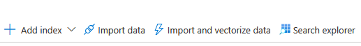
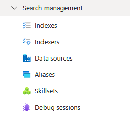

This comprehensive exercise demonstrates the complete integration of custom skills into your search pipeline. You'll modify the skillset definition to include your Azure Function, update the index schema for custom outputs, configure field mappings, and run the enhanced indexer. Then you'll validate the solution by comparing built-in versus custom sentiment analysis, querying hotel-specific topics, analyzing confidence scores, and executing business intelligence queries that showcase the competitive advantage of domain-specific AI enrichment.

## Instructions.

Now we'll test our search solution using Azure Portal's built-in Search Explorer to see how it works without Custom skill with Azure Function.

1. Navigate to your Azure AI Search resource. Search AI Search in Azure portal:
   
   

2. Select the `omnicorp-search-3456` Ai Search:
   
   

3. Click `Search explorer` at the top:
   
   


4.  Simple text search**
   
    1. Excellent Service search
       - search for `excellent service` and Click **Search**:
       - Look at the results - you should see hotel reviews mentioning excellent service
       - Notice fields like `sentiment` and `keyphrases` are sentiment-related fields

    2. Wildcard search 
         - Search for: `hotel*`
         - This finds any content starting with "hotel"


    3. Empty search (see everything)**
       - Leave search box empty or type: `*`
       - This shows all documents in the index


5. Set the `View` to `{ } JSON view`:

    

   1. In Search Explorer, run this query to see what fields are available:
        ```json
        {
        "search": "*",
        "top": 1
        }
        ```
   - Look at the results to see field names like:
     * `sentiment` or `sentimentLabels` (for sentiment analysis)
     * `keyphrases` (for key phrases)
   


   2. Filter by sentiment:
   
        ```json
        {
        "search": "*",
        "filter": "sentiment eq '[\"positive\"]'"
        }
        ```

        **If you get a "field not filterable" error**, try these alternatives:
                - Check what sentiment fields exist: `{"search": "*", "top": 1}` and look at field names
                - The sentiment field might be named differently, like `sentimentLabels` or `sentimentScore`
                - Or use this query to see all available fields:

        ```json
            {
                "search": "*",
                "select": "*",
                "top": 1
            }
        ```                  

   3. Sort by a field:

        ```json
            {
            "search": "*",
            "orderby": "sentiment desc"
            }
        ```

6. Advanced Query Examples:
    1. Faceted search (analytics)**
       - First, identify your sentiment field name from the earlier test
       - Try this query (replace `sentiment` with your actual field name)
       - Look at the `@search.facets` section in results to see counts
  
        ```json
            {
            "search": "*",
            "facets": ["sentiment"],
            "top": 0
            }
        ```

    

   2.  Phrase search:
   
       - Search for exact phrases with quotes:

        ```json
        {
        "search": "\"excellent service\""
        }
        ```

 Now we'll enhance our search solution by adding a custom Azure Function that provides more detailed sentiment analysis. This shows how to connect Azure Functions with Azure AI Search.


7. Get the Azure Function URL. Go to your Function App in Azure Portal:
    

8.  select `Functions` and click on   `analyze_sentiment`:
   
    

9.  Click **Get Function Url** :
    
    

10. Copy the `default(Function key)` URL. The URL should look like: 
    
    `https://omnicorpcustomskillfunc-b5dqa3h4gmfbdgcg.eastus-01.azurewebsites.net/api/AnalyzeSentiment?code=*******************************-A==`

11. Update Skillset to Include Custom Function. Go to your Azure AI Search service and Click `Skillsets` in the left menu:
    
    

12. Click on `hotel-reviews-skillset`:
    
    

13. Add Custom Skill to Skillset (With Correct Field Names)
    1. In the JSON editor, find the `"skills"` array
    2. Add this custom skill to the skills array (before the closing `]`):

    ***Add the your Function URL at the uri***
    ```json
        ,{
        "@odata.type": "#Microsoft.Skills.Custom.WebApiSkill",
        "name": "CustomHotelSentimentAnalysis",
        "description": "Custom sentiment analysis for hotel reviews",
        "uri": "YOUR_FUNCTION_URL_HERE",
        "httpMethod": "POST",
        "timeout": "PT30S",
        "context": "/document",
        "inputs": [
            {
            "name": "reviewText",
            "source": "/document/reviews_text"
            },
            {
            "name": "rating",
            "source": "/document/reviews_rating"
            },
            {
            "name": "hotelName",
            "source": "/document/name"
            }
        ],
        "outputs": [
            {
            "name": "sentiment",
            "targetName": "customSentiment"
            },
            {
            "name": "confidence",
            "targetName": "sentimentConfidence"
            },
            {
            "name": "topics",
            "targetName": "reviewTopics"
            },
            {
            "name": "rating_based",
            "targetName": "ratingBasedSentiment"
            }
        ]
        }
    ```
        
    3. Click `Save`:

        


14.  Run Indexer to process new Documents. 
    
     * Go to `Indexer` in `omnicorp-custskillset-#### `search Service:
     * select  `hotel-reviews-indexer`:
     * Select `Run ` to run the indexer again:
     

     * The indexer should process ~19 documents instead of 1.
     


15. Update Index to Include Custom Fields:
    *  Go to `Indexes` and select `azureblob-index` (your actual index name)
    *  Click `{ } Edit JSON`:
    
    *  In the `"fields"` array, add these new fields for your custom analysis (add them before the closing `]`):

```json
,{
  "name": "customSentiment",
  "type": "Edm.String",
  "searchable": true,
  "filterable": true,
  "retrievable": true,
  "stored": true,
  "sortable": false,
  "facetable": true,
  "key": false,
  "analyzer": "standard.lucene",
  "synonymMaps": []
},
{
  "name": "sentimentConfidence",
  "type": "Edm.Double",
  "searchable": false,
  "filterable": true,
  "retrievable": true,
  "stored": true,
  "sortable": true,
  "facetable": false,
  "key": false,
  "synonymMaps": []
},
{
  "name": "reviewTopics",
  "type": "Collection(Edm.String)",
  "searchable": true,
  "filterable": true,
  "retrievable": true,
  "stored": true,
  "sortable": false,
  "facetable": true,
  "key": false,
  "synonymMaps": []
},
{
  "name": "ratingBasedSentiment",
  "type": "Edm.Boolean",
  "searchable": false,
  "filterable": true,
  "retrievable": true,
  "stored": true,
  "sortable": false,
  "facetable": true,
  "key": false,
  "synonymMaps": []
}
```

 *  Click `Save`:
  
    


16. Update Indexer to Map Your CSV Fields
    * Go to `Indexer` in `omnicorp-custskillset-#### `search Service
    * select  `hotel-reviews-indexer`:
    * Click `{ } Edit JSON`:
    * Your `"fieldMappings"` should already be correct (the wizard created them automatically)
    *  Add/update the `"outputFieldMappings"` section to include your custom skill outputs:

```json
"outputFieldMappings": [
  {
    "sourceFieldName": "/document/customSentiment",
    "targetFieldName": "customSentiment"
  },
  {
    "sourceFieldName": "/document/sentimentConfidence",
    "targetFieldName": "sentimentConfidence"
  },
  {
    "sourceFieldName": "/document/reviewTopics",
    "targetFieldName": "reviewTopics"
  },
  {
    "sourceFieldName": "/document/ratingBasedSentiment",
    "targetFieldName": "ratingBasedSentiment"
  }
]
```

 * Click `Save`:
  
    

**Note about your data types**:
- `reviews_rating` is stored as **string** ("1", "2", "3", "4", "5") not integer
- `latitude` and `longitude` are stored as **strings** not doubles
- Your Azure Function should handle these as strings

17. Run the Enhanced Indexer
    1. Go to `Indexer` in `omnicorp-custskillset-#### `search Service.
    2.  Click `Reset` to reset indexer.
    3.  Click `Run` to rerun the indexer with new changes. The indexer will now process data through both built-in skills AND your custom function

        


18. Test Custom Skill Results:

    1. Click `Search explorer` at the top:
    2. Set the `View` to `{ } JSON view`: Try this query to see both sentiment analyses:

```json
{
  "search": "*",
  "select": "sentiment,customSentiment",
  "top": 5
}
```

You should now see:
- `sentiment`: From built-in cognitive skill
- `customSentiment`: From your Azure Function

---

19. Testing and Understanding Custom Skills. Verify your custom Azure Function is working and understand the difference between built-in and custom skills.

 Compare Built-in vs Custom Results (With Your Actual Index)

**Query 1: Test your actual hotel reviews (individual documents)**
```json
{
  "search": "*",
  "select": "name,reviews_text,reviews_rating,sentiment,customSentiment",
  "top": 3
}
```

**What you should see** (individual reviews):
```json
[
    {
      "@search.score": 1,
      "name": "Hotel Russo Palace",
      "reviews_rating": "5",
      "reviews_text": "Located on the Lido I would recommend this hotel if you require a little piece and quiet after the busy day's in Venice, facility's good, staff very friendly and very helpful. I requested flowers for the room as it was one of my wife's special birthday's, and yes they ordered exactly as requested, can't ask for more. Rooms are a little on the small side but in line with most European hotels of this standard so wasn't a surprise or a problem, room and bathroom was cleaned every day with fresh towels supplied each day. Buffet breakfast had various options to suit most peoples taste but It was a surprise to see sausage, bacon and scrambled eggs available, must have been put on to satisfy us Brits! We stayed during late September so the Lido is probably quieter at that time however we felt very safe walking around late at night back to the hotel but taxis are available if you feel a little vulnerable. Restaurants and coffee bars are located in the main commercial area close to the Waterbus stations and tend to be slightly cheaper than in Venice. We had a water taxi (think luxury speed boat!) from the airport to the hotel and back again, quite an experience, a little costly but well worth it, a lot quicker and less hassle than the Waterbus. Venice was very busy during the day time, St Marks Square at night is a must, fantastic atmosphere. All in all we had a great time in Venice, it can be a little expensive so don't ponder over the bills to much, just pay up with a smile!",
      "sentiment": "[\"mixed\"]",
      "customSentiment": "Positive"
    },
    {
      "@search.score": 1,
      "name": "Hotel Russo Palace",
      "reviews_rating": "4",
      "reviews_text": "Nice staff. Nice location. We booked two nights at Russo hotel on Lido strip and two nights in the very center of Venice. This is a good balance. Lido is a bit further but it feels more local and is more relaxing too, it gave us a taste of Dolce Vita. We didn't see it on the hotel description but they offered us a taxi boat ride to Murano with another couple for free. The boat ride was very pleasant, they dropped us in a glass blowing factory shop, the glass making demonstration was nice and there was very little pressure to buy. Internet was free for 20 minutes/day but a bit slow like everywhere in Venice. So in short a good pick, good value for money.",
      "sentiment": "[\"mixed\"]",
      "customSentiment": "Positive"
    },
    
  
```

**Query 2: See custom analysis details**
```json
{
  "search": "*",
  "select": "name,customSentiment,sentimentConfidence,reviewTopics,reviews_rating,reviews_username",
  "top": 5
}
```

**What you should see RIGHT NOW** (before adding custom skill):

```json
{
      "@search.score": 1,
      "name": "Hotel Russo Palace",
      "reviews_rating": "5",
      "reviews_username": "A & D",
      "customSentiment": "Positive",
      "sentimentConfidence": 0.9,
      "reviewTopics": [
        "Room Quality",
        "Service",
        "Location",
        "Food",
        "Value"
      ]
    },
    {
      "@search.score": 1,
      "name": "Hotel Russo Palace",
      "reviews_rating": "4",
      "reviews_username": "Niklas",
      "customSentiment": "Positive",
      "sentimentConfidence": 0.8,
      "reviewTopics": [
        "Service",
        "Location",
        "Value"
      ]
    },...
```


**Query 3: Find reviews your custom function marked as "Positive"**
```json
{
  "search": "*",
  "filter": "customSentiment eq 'Positive'",
  "select": "reviews_text,customSentiment",
  "top": 5
}
```

**Query 4: Find reviews your custom function marked as "Negative"**
```json
{
  "search": "*", 
  "filter": "customSentiment eq 'Negative'",
  "select": "reviews_text,customSentiment",
  "top": 5
}
```

**Query 5: Count results by custom sentiment**
```json
{
  "search": "*",
  "facets": ["customSentiment"],
  "top": 0
}
```

**What you should see**:

```json
    "@search.facets": {
    "customSentiment": [
        {"value": "Positive", "count": 150},
        {"value": "Negative", "count": 75}, 
        {"value": "Neutral", "count": 25}
        ]
    }
```

**Query 6: Find reviews about room quality**
```json
{
  "search": "room OR bed OR bathroom OR clean",
  "select": "name,reviews_text,customSentiment,reviewTopics",
  "top": 5
}
```
**Expected result**: These should have "Room Quality" or "Service" in the `reviewTopics` field

**Query 7: Find reviews about hotel service**
```json
{
  "search": "staff OR service OR reception OR helpful",
  "select": "name,reviews_text,customSentiment,reviewTopics",
  "top": 5
}
```

**Expected result**: These should have "Room Quality" or "Service" in the `reviewTopics` field


**Query 8: Compare sentiment methods for business insights**
```json
{
  "search": "*",
  "facets": ["sentiment", "customSentiment"],
  "top": 0
}
```

**What this shows**:
```bash

    "customSentiment": [
        {
            "value": "Positive",
            "count": 13
        },
        {
            "value": "Negative",
            "count": 4
        },
        {
            "value": "Neutral",
            "count": 2
        }
        ],
        "sentiment": [
        {
            "value": "[\"mixed\"]",
            "count": 9
        },
        {
            "value": "[\"positive\"]",
            "count": 8
        },
        {
            "value": "[\"negative\"]",
            "count": 1
        },
        {
            "value": "[\"neutral\"]",
            "count": 1
        }
        ]

```
**Query 9: Hotel performance analysis**
```json
{
  "search": "*",
  "facets": ["name", "customSentiment", "reviews_rating"],
  "top": 0
}
```

**Query 10: Geographic analysis**
```json
{
  "search": "*",
  "facets": ["city", "customSentiment"],
  "filter": "customSentiment eq 'Positive'",
  "top": 0
}
```

**Query 11: Rating vs Sentiment analysis (comparing Azure vs Your function)**
```json
{
  "search": "*",
  "select": "name,reviews_rating,sentiment,customSentiment,sentimentConfidence",
  "orderby": "sentimentConfidence desc",
  "top": 10
}
```

**Business Insights You Can Get**:
- Which sentiment method is more accurate for your business?
- Do Azure's `["positive"]` results align with your `"Positive"` results?
- Are there rating patterns (5-star reviews that both methods agree are positive)?
- Which hotels consistently get positive sentiment regardless of method?


Here's a completion summary for the end of the lab:

## Lab Completion Summary

You have successfully built a comprehensive Azure AI Search solution that demonstrates the power of custom skills integration. Through this hands-on lab, you created a complete AI enrichment pipeline that processes hotel review data using both Azure's built-in cognitive services and your own custom Azure Function. The solution combines standard sentiment analysis and key phrase extraction with hotel industry-specific intelligence, including topic categorization, confidence scoring, and rating alignment analysis.

The architecture you implemented showcases how custom skills extend Azure AI Search beyond generic capabilities to deliver domain-specific business value. Your custom Azure Function applies specialized hospitality industry rules that understand nuances like room quality complaints, service excellence indicators, and location advantages that standard AI models cannot interpret. This creates a competitive advantage through more accurate sentiment analysis and actionable business insights.

Key technical competencies mastered include designing HTTP-based custom skills, integrating Azure Functions with search pipelines, configuring complex skillsets with multiple enrichment stages, and building sophisticated search queries that leverage both built-in and custom AI outputs. The solution demonstrates enterprise-ready patterns for scalable document processing, error handling, and performance optimization.

This foundation enables you to tackle more advanced scenarios such as multi-language processing, external API integration, machine learning model deployment, and complex business workflow automation within Azure AI Search. The custom skills framework provides the flexibility to adapt AI processing to any industry-specific requirements while maintaining the scalability and reliability of cloud-native architecture.
